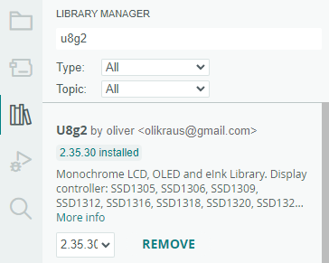
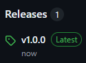
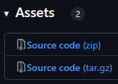
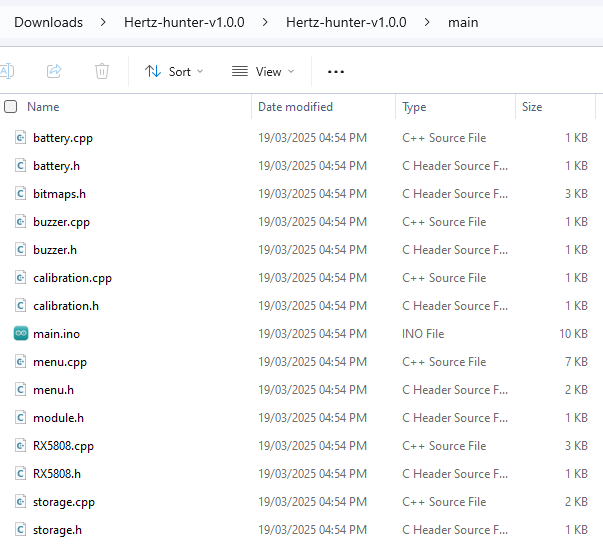
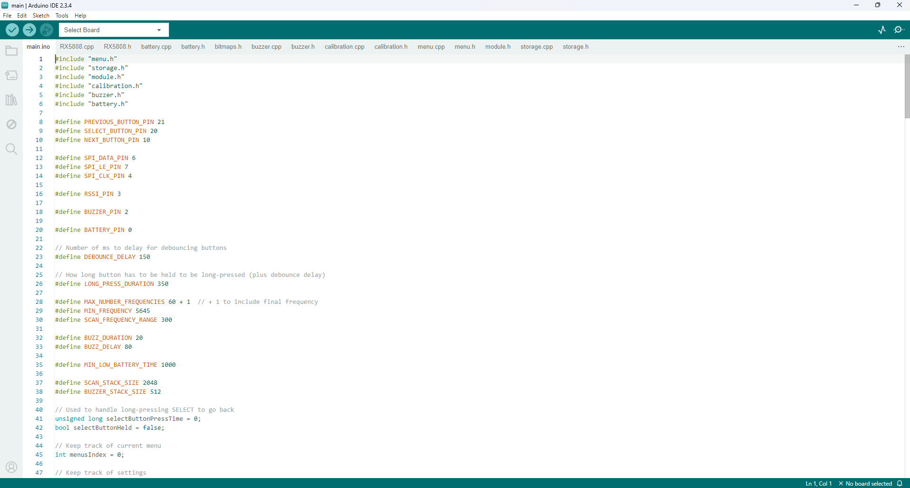
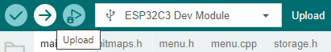

# Hertz Hunter

## Contents

1. [Introduction](#introduction)
2. [Features](#features)
    - [Potential future features](#potential-future-features)
3. [Hardware](#hardware)
    - [Components](#components)
    - [Wiring](#wiring)
4. [Software](#software)
    - [Environmental setup](#environment-setup)
    - [Firmware setup](#firmware-setup)
    - [Flashing](#flashing)
    - [Battery calibration](#battery-calibration)
5. [Usage](#usage)
    - [Menus](#menus)
    - [Scanning](#scanning)
    - [Wi-Fi hotspot](#wi-fi-hotspot)
    - [RSSI calibration](#rssi-calibration)
    - [Resetting](#resetting)

## Introduction

A poor-man's [RF Explorer](https://j3.rf-explorer.com/) for FPV drones. Useful for quickly determining which frequencies are in use, where background noise is occurring, and diagnosing malfunctioning video transmitters (VTXs). Designed to be cheap (<$60 AUD) and easy to build yourself.

At a racing event I attended there was an issue with someone's damaged VTX broadcasting at full power on two channels, thus interfering with another pilot. A spectrum analyser was essential for diagnosing this issue, as two peaks at different frequencies could be seen in the spectrum graph when only the damaged VTX was powered on.

This project aims to make this useful tool more accessible to pilots and race organisers, and can be easily added to a race-day tool bag. It uses a common RX5808 video receiver to scan from 5645MHz to 5945MHz (and 5345MHz to 5645MHz for low-band channels) and displays a graph of the received signal strength (RSSI) on different frequencies within this range on a small OLED display.

*Example of a soldered prototype*

<div align="center">
    
    
</div>

## Features

- Scanning of the RF spectrum commonly used for video by FPV racing drones (5645MHz to 5945MHz) and additional low-band (5345MHz to 5645MHz) frequencies
- Graphing RSSI to show which frequencies VTXs are broadcasting on
- Three buttons (`PREV`, `SEL`, `NEXT`) for navigating menus and controlling the device
- Selectable scanning interval
    - A 5MHz interval offers the highest resolution at the slowest update rate
    - A 10MHz interval offers a medium resolution at a medium update rate
    - A 20MHz interval offers the lowest resolution at the fastest update rate
- Battery voltage monitoring with a low battery alarm
- Calibration between known low and high RSSI values
- Displaying calibrated signal strength for the selected frequency
- Settings saved between reboots
- API accessible from a Wi-Fi hotspot for integration with other software ([Documentation](API.md))

### Potential future features

> [!NOTE]
>
> No commitment is made to implementing these. They're things I think would be cool to do, but may never actually see the light of day.

- Custom PCB with integrated power management circuitry
- 3D printed case for a custom PCB
- Web interface to interact with the scanner and display more detailed graphs
    - **IN DEVELOPMENT- Check out the `web-ui` branch for progress updates**

## Hardware

Hardware designs, including the original DIY design, have been moved to a dedicated repository **[HERE](https://github.com/odddollar/Hertz-hunter-hardware)**.

## Software

### Environment setup

**1. Install the Arduino IDE**

Download the [Arduino IDE](https://www.arduino.cc/) and install it.

**2. Update `Additional boards manager URLs`**

The ESP32 board used in this project isn't supported out-of-the-box by the Arduino IDE, so it needs to be added manually.

In the Arduino IDE, open `File > Preferences`, and in the `Additional boards manager URLs` field, paste the following, then click `OK`:

```
https://raw.githubusercontent.com/espressif/arduino-esp32/gh-pages/package_esp32_index.json
```

This will update the list that the Arduino IDE checks to know where to install additional boards from, but doesn't actually install the board. 

**3. Install ESP32 support**

Go to `Tools > Board > Boards Manager` and search for `ESP32`. Install the one by `Espressif Systems`.

<div align="center">
    
</div>

**4. Install required libraries**

Go to `Tools > Manage Libraries`, then search for and install the following libraries:

- `U8G2` by `oliver <olikraus@gmail.com>`
- `ESP Async WebServer` by `ESP32Async`
- `Async TCP` by `ESP32Async`
- `ArduinoJson` by `Benoit Blanchon <blog.benoitblanchon.fr>`

<div align="center">
    
</div>

### Firmware setup

**1. Download firmware**

On GitHub, under `Releases`, click the most recent version.

<div align="center">
    
</div>

Under `Assets`, click the `Source code (zip)` link to download the firmware.

<div align="center">
    
</div>

**2. Open firmware in Arduino IDE**

Unzip the downloaded file. You should see the project files within. Open the folder named `main`, which contains all the source code files for the firmware.

<div align="center">
    
</div>

Double click `main.ino`, which should open in the Arduino IDE, along with the rest of the source code files.

<div align="center">
    
</div>

**3. (If necessary) Change display chip being used**

> [!IMPORTANT]
>
> This step is only necessary if using an OLED with the SSD1306 chip. OLEDs that use the SH1106 chip require no modification to the firmware.

As far as I can tell, most 0.96" I<sup>2</sup>C OLEDs use the SSD1306 chip, but I think a bigger 1.3" OLED is better for this project, which mostly seem to use the SH1106 controller. As such, the SH1106 controller is what this device has been developed for, but with some slight modifications it should be possible to use SSD1306 displays.

> [!NOTE]
>
> I haven't personally tested this. All the 1.3" OLEDs I've used have SH1106 chips.

Open `menu.h` and find the following line:

```cpp
U8G2_SH1106_128X64_NONAME_F_HW_I2C u8g2;
```

Below this line there should be:

```cpp
// U8G2_SSD1306_128X64_NONAME_F_HW_I2C u8g2;
```

Add `//` to the front of the first line and remove it from the front of the second line.

**4. (If necessary) Change SSID and password for Wi-Fi hotspot**

> [!IMPORTANT]
>
> This step is only necessary if the default SSID `Hertz Hunter` and password `hertzhunter` isn't suitable for your use case. The Wi-Fi hotspot is only used for web-based interactions with the device, such as accessing the [API](API.md).

Open `api.h` and find the following lines:

```cpp
#define WIFI_SSID "Hertz Hunter"
#define WIFI_PASSWORD "hertzhunter"
```

Change these values to whatever you want, but note that text that is too long will run off the screen on the Wi-Fi menu.

### Flashing

**1. Connect ESP32**

Plug the ESP32 module into the computer with a USB-C cable.

**2. Select board**

Go to `Tools > Board > esp32` and select `ESP32C3 Dev Module`. 

**3. Select port**

Go to `Tools > Port` and select the port the ESP32 is plugged into.

<div align="center">
    
</div>

**4. Compile and upload firmware**

Click the `Upload` button to compile the firmware and upload it to the ESP32.

<div align="center">
    
</div>

> [!TIP]
>
> If you're getting errors during flashing, or the device doesn't appear, go to `Tools > USB CDC On Boot` and change it to `Enabled`. This allows the USB connection to remain active during boot, which can help with problems where the port isn't detected after the ESP32 reboots.

### Battery calibration

Different boards, even of the same model, can have variations in their analog-to-digital converters, so performing a simple calibration is necessary to ensure the device reads the correct battery voltage.

Turn the device on, and in the bottom right corner of the main menu there will be a battery voltage readout, displaying, for example, `4.0v`. Take a multimeter and measure the raw battery voltage, rounded to 1 decimal place. The voltage on the multimeter and the voltage displayed on the main menu should ideally be the same, but it may be off by a small amount.

The value of `BATTERY_VOLTAGE_OFFSET` in `battery.h` can be increased or decreased, where a change of `1` in this value corresponds to a change of `0.1` in the displayed voltage.

For example, if the main menu is displaying `3.9v`, but the multimeter says the battery is at `4.0v`, then increase the value of `BATTERY_VOLTAGE_OFFSET` by `1`. If the menu displays a voltage higher than what the multimeter reads, then decrease the offset value.

Make the necessary changes, then compile and upload the firmware again.

## Usage

### Menus

There are three buttons used to operate the device:

- `PREV` - Go to the previous item
- `SEL` - Select an item
    - Press and hold `SEL` to go back
- `NEXT` - Go to the next item

The menu items can be navigated between with `PREV` and `NEXT`, and once the desired menu item is highlighted, `SEL` can be used to select it.

**Main**

This is the initial menu displayed when the device is powered on. It displays the options to navigate to the `Scan` menu, `Settings` submenus, `About` menu, and a hidden `Advanced` submenu. The current battery voltage is also displayed in the bottom right.

The hidden `Advanced` submenu can be accessed by pressing and holding `SEL`.

**Scan**

This menu is where the graph of the scanned RSSI values is displayed and is covered more in [Scanning](#scanning).

**Scan interval**

Set the interval at which the spectrum will be scanned. A lower scan interval means that more frequencies are scanned, at the cost of taking longer to complete a full refresh, as each frequency takes about 30ms to scan. A higher scan interval means that fewer frequencies are scanned, but a full refresh is significantly faster.

Across the 300MHz spectrum being scanned (5645MHz to 5945Hz, and 5345MHz to 5645MHz):

- `5MHz` scans 61 frequencies every 5MHz
    - $(300/5)+1$ to also include the final frequency
- `10MHz` scans 31 frequencies every 10MHz
    - $(300/10)+1$ to also include the final frequency
- `20MHz` scans 16 frequencies every 20MHz
    - $(300/20)+1$ to also include the final frequency

The currently set option is displayed with the  icon.

**Buzzer**

Enable or disable the single beep that sounds on pressing a button, and the double beep that sounds on going back. This option doesn't affect the double beep on boot, nor the low battery alarm. These will always sound.

The currently set option is displayed with the  icon.

**Battery alarm**

Set the voltage that the low battery alarm will go off at.

The currently set option is displayed with the  icon.

**About**

Displays information about the device, such as the current firmware version and the creator's name.

**Wi-Fi**

Starts the Wi-Fi hotspot, displaying the SSID, password, and IP address of the device. Connect to this hotspot and use the provided IP to access web-based features, such as the API. Exiting this menu stops the hotspot and disconnects any connected devices. This feature is covered more in [Wi-Fi hotspot](#wi-fi-hotspot).

**Calibration**

Where calibration of known high and low RSSI values takes place. Helper text is displayed at the bottom to remind you which channel to set your VTX to when calibrating. This menu is covered more in [RSSI calibration](#rssi-calibration).

### Scanning

A column graph of the measured RSSI values is displayed in the `Scan` menu, where stronger signals are shown with a taller bar at the detected frequency. The device doesn't care what data is being sent on a frequency, only that there is something there, meaning that it isn't limited to just analog video signals. The graph will be updated live as the scanner goes through each frequency continuously. Once a scan of the entire spectrum has been completed it will start again and update the values.

The top left of the screen displays `HIGH` or `LOW` depending on the frequency range being scanned (`HIGH` for 5645MHz to 5945MHz, and `LOW` for 5345MHz to 5645MHz). These two scanning modes can be switched between with `SEL`.

There is a cursor that can be moved along the spectrum using the `PREV` and `NEXT` buttons. The frequency the cursor is currently on is displayed in the top middle of the screen, and the signal strength on that frequency is reported as a percentage in the top right. More on how this percentage is calculated is covered in [RSSI calibration](#rssi-calibration).

In combination with the frequency markings along the bottom of the screen, this cursor can be used to find what frequency something is broadcasting on, and the strength of the broadcast.

*The cursor shows that something is broadcasting on R4*

<div align="center">
    
</div>

### Wi-Fi hotspot

The Wi-Fi hotspot is provided as a means of accessing additional features through a web-based interface. Currently this includes an API that allows Hertz Hunter to be integrated into other software, thus greatly extending the functionality beyond just the physical device.

The hotspot is started when the `Wi-Fi` menu is selected, and is stopped when this menu is exited. When the hotspot is running, the device scans the RF spectrum as it would when viewing the `Scan` menu, however it does it in the background and doesn't draw a graph on the display.

On this menu the configured SSID and password for the hotspot is displayed, which can be connected to from another device, such as a phone or computer. The IP is the address of the Hertz Hunter device and is where all requests should be sent to. The documentation for the API is available [here](API.md), and currently includes the following features:

- Requesting the current battery voltage
- Requesting up-to-date RSSI data
- Switching between high and low band scanning
- Requesting the current settings for the scan interval, buzzer state, and low battery alarm
- Updating the current settings for the scan interval, buzzer state, and low battery alarm
- Requesting the calibrated minimum and maximum signal strength values
- Setting the calibrated minimum and maximum signal strength values

<div align="center">
    
</div>

### RSSI calibration

The scale of the graph and the signal strength readout in the `Scan` menu is controlled by the calibrated minimum and maximum RSSI values.

To calibrate:

1. Ensure no VTXs are transmitting on or near 5800MHz (F4)
2. Highlight `Calib. low` and press `SEL`
    - This saves an RSSI value that will be used for "nothing broadcasting" and allows for filtering out the base level of RF noise (i.e. the noise floor)
3. Plug in a VTX and set it to broadcast on 5800MHz (F4)
4. Highlight `Calib. high` and press `SEL`
    - This saves an RSSI value that will be used for "something broadcasting" and allows for proper scaling of the graph and signal strength readout


The signal strength readout will display `100%` for any RSSI that is at or higher than the RSSI captured when `Calib. high` was selected, and `0%` for any RSSI that is at or lower than the RSSI captured when `Calib. low` was selected. Any RSSI that falls between the calibrated high and low values will be mapped to a percentage based on its strength relative to the calibrated values.

*Helper text is present to remind you which channel to use for calibration*

<div align="center">
    
</div>

### Resetting

Due to the fact that the settings and calibration values are stored in non-volatile memory, flashing the firmware again won't wipe them. If, for some reason, the device needs to be completely reset, press `PREV`, `SEL` and `NEXT` simultaneously. The device should reboot with everything completely wiped and reset.

