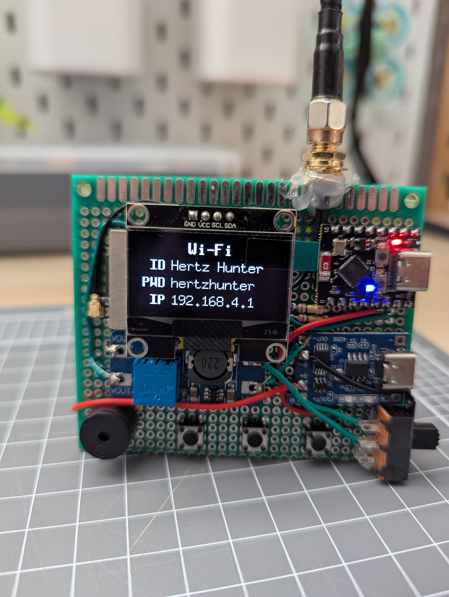
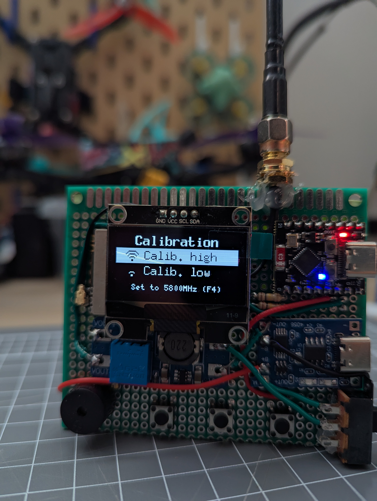

# Usage

## Menus

There are three buttons used to operate the device:

- `PREV` - Go to the previous item
- `SEL` - Select an item
  - Press and hold `SEL` to go back
- `NEXT` - Go to the next item

The menu items can be navigated between with `PREV` and `NEXT`, and once the desired menu item is highlighted, `SEL` can be used to select it.

### Main

This is the initial menu displayed when the device is powered on. It displays the options to navigate to the `Scan` menu, `Settings` submenus, `About` menu, and a hidden `Advanced` submenu. The current battery voltage is also displayed in the bottom right.

The hidden `Advanced` submenu can be accessed by pressing and holding `SEL`.

### Scan

This menu is where the graph of the scanned RSSI values is displayed and is covered more in [Scanning](#scanning).

### Scan interval

Set the interval at which the spectrum will be scanned. A lower scan interval means that more frequencies are scanned, at the cost of taking longer to complete a full refresh, as each frequency takes about 30ms to scan. A higher scan interval means that fewer frequencies are scanned, but a full refresh is significantly faster.

Across the 300MHz spectrum being scanned (5645MHz to 5945Hz, and 5345MHz to 5645MHz):

- `2.5MHz` scans 121 frequencies every 2.5MHz
  - $(300/2.5)+1$ to also include the final frequency
  - The RX5808 module only supports 1MHz increments, so this interval is rounded to the nearest integer (e.g. 5800, 5803, 5805, 5808, ...)
- `5MHz` scans 61 frequencies every 5MHz
  - $(300/5)+1$ to also include the final frequency
- `10MHz` scans 31 frequencies every 10MHz
  - $(300/10)+1$ to also include the final frequency

The currently set option is displayed with the  icon.

### Buzzer

Enable or disable the single beep that sounds on pressing a button, and the double beep that sounds on going back. This option doesn't affect the double beep on boot, nor the low battery alarm. These will always sound.

The currently set option is displayed with the  icon.

### Battery alarm

Set the voltage that the low battery alarm will go off at.

The currently set option is displayed with the  icon.

### About

Displays information about the device, such as the current firmware version and the creator's name.

### Wi-Fi

Starts the Wi-Fi hotspot, displaying the SSID, password, and IP address of the device. Connect to this hotspot and use the provided IP to access web-based features, such as the API. Exiting this menu stops the hotspot and disconnects any connected devices. This feature is covered more in [Wi-Fi hotspot](#wi-fi-hotspot).

### Calibration

Where calibration of known high and low RSSI values takes place. Helper text is displayed at the bottom to remind you which channel to set your VTX to when calibrating. This menu is covered more in [RSSI calibration](#rssi-calibration).

## Scanning

A column graph of the measured RSSI values is displayed in the `Scan` menu, where stronger signals are shown with a taller bar at the detected frequency. The device doesn't care what data is being sent on a frequency, only that there is something there, meaning that it isn't limited to just analog video signals. The graph will be updated live as the scanner goes through each frequency continuously. Once a scan of the entire spectrum has been completed it will start again and update the values.

The top left of the screen displays `HIGH` or `LOW` depending on the frequency range being scanned (`HIGH` for 5645MHz to 5945MHz, and `LOW` for 5345MHz to 5645MHz). These two scanning modes can be switched between with `SEL`.

There is a cursor that can be moved along the spectrum using the `PREV` and `NEXT` buttons. The frequency the cursor is currently on is displayed in the top middle of the screen, and the signal strength on that frequency is reported as a percentage in the top right. More on how this percentage is calculated is covered in [RSSI calibration](#rssi-calibration).

In combination with the frequency markings along the bottom of the screen, this cursor can be used to find what frequency something is broadcasting on, and the strength of the broadcast.

*The cursor shows that something is broadcasting on R4*

    

## Wi-Fi hotspot

The Wi-Fi hotspot is provided as a means of accessing additional features through a web-based interface. Currently this includes an API that allows Hertz Hunter to be integrated into other software, thus greatly extending the functionality beyond just the physical device.

The hotspot is started when the `Wi-Fi` menu is selected, and is stopped when this menu is exited. When the hotspot is running, the device scans the RF spectrum as it would when viewing the `Scan` menu, however it does it in the background and doesn't draw a graph on the display.

On this menu the configured SSID and password for the hotspot is displayed, which can be connected to from another device, such as a phone or computer. The IP is the address of the Hertz Hunter device and is where all requests should be sent to. The documentation for the API is available [here](API.md), and currently includes the following features:

- Requesting the current battery voltage
- Requesting up-to-date RSSI data
- Switching between high and low band scanning
- Requesting the current settings for the scan interval, buzzer state, and low battery alarm
- Updating the current settings for the scan interval, buzzer state, and low battery alarm
- Requesting the calibrated minimum and maximum signal strength values
- Setting the calibrated minimum and maximum signal strength values

    

## RSSI calibration

The scale of the graph and the signal strength readout in the `Scan` menu is controlled by the calibrated minimum and maximum RSSI values.

To calibrate:

1. Ensure no VTXs are transmitting on or near 5800MHz (F4)
2. Highlight `Calib. low` and press `SEL`
   - This saves an RSSI value that will be used for "nothing broadcasting" and allows for filtering out the base level of RF noise (i.e. the noise floor)
3. Plug in a VTX and set it to broadcast on 5800MHz (F4)
4. Highlight `Calib. high` and press `SEL`
   - This saves an RSSI value that will be used for "something broadcasting" and allows for proper scaling of the graph and signal strength readout

The signal strength readout will display `100%` for any RSSI that is at or higher than the RSSI captured when `Calib. high` was selected, and `0%` for any RSSI that is at or lower than the RSSI captured when `Calib. low` was selected. Any RSSI that falls between the calibrated high and low values will be mapped to a percentage based on its strength relative to the calibrated values.

*Helper text is present to remind you which channel to use for calibration*

    

## Resetting

Due to the fact that the settings and calibration values are stored in non-volatile memory, flashing the firmware again won't wipe them. If, for some reason, the device needs to be completely reset, press `PREV`, `SEL` and `NEXT` simultaneously. The device should reboot with everything completely wiped and reset.